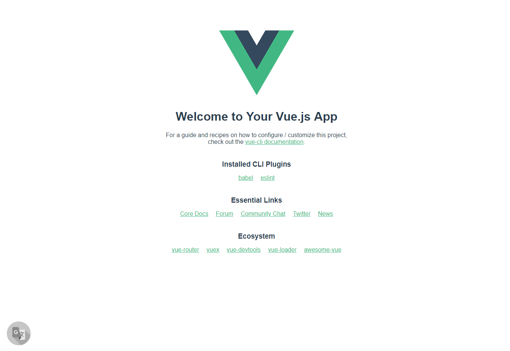
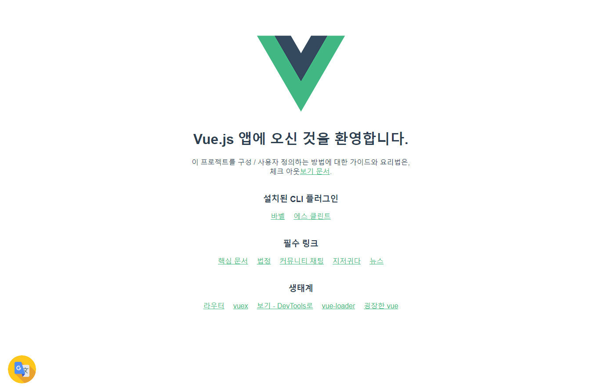

# page-translator


A Vue component that was created to replace a broken Google page translation service.

This component uses the `Google Cloud Translation API` and requires your  `API KEY`.

<br>

## Usage

>  ### Get Google Cloud Translation API KEY

- [Google Cloud Translation API](https://cloud.google.com/translate/?hl=ko&utm_source=google&utm_medium=cpc&utm_campaign=japac-KR-all-ko-dr-bkws-all-super-trial-e-dr-1003987&utm_content=text-ad-none-none-DEV_c-CRE_263225556921-ADGP_Hybrid+%7C+AW+SEM+%7C+BKWS+~+T1+%7C+EXA+%7C+ML+%7C+1:1+%7C+KR+%7C+ko+%7C+Translation+%7C+google+translate+api+%7C+en-KWID_43700031880242880-kwd-14329410560&userloc_1009871&utm_term=KW_google%20translate%20api&gclid=EAIaIQobChMIsYCE9_u44wIVj3ZgCh3MEwdKEAAYASAAEgILN_D_BwE)

<br>

> ### Install

- ```js
  npm install @nnm/page-translator
  ```

<br>

> ### Use

- ```js
  import 'page-translator' from '@nnm/page-translator'
  import '@nnm/page-translator/dist/page-translator.css
  ```

- ```js
  ...
  Vue.use(page-translator);
  ...
  ```

- ```js
  <page-translator target="laungage code ex) en, ko ..." 
                   position="left or right"
                   apikey="Input your API KEY"
  />
  ```

<br>

- Translator OFF

  


- Translator ON

  


<br>

## Bug

- The function does not work if you press the button several times quickly.
  - I think it's a function synchronization problem or DOM tree's rendering problem. I would appreciate it if you gave me a hint.

<br>

## License

This is released under the MIT license. See [LICENSE](./license) for details.


